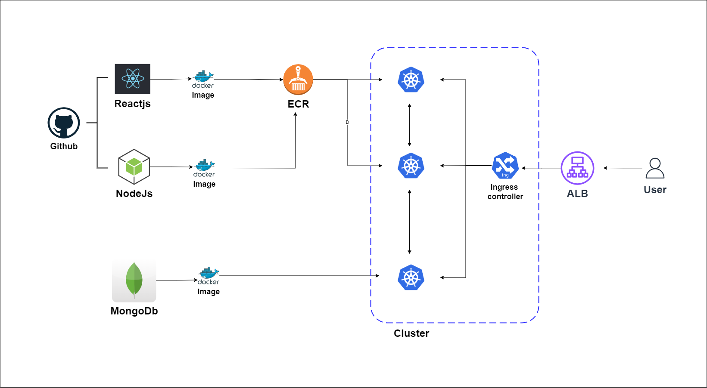
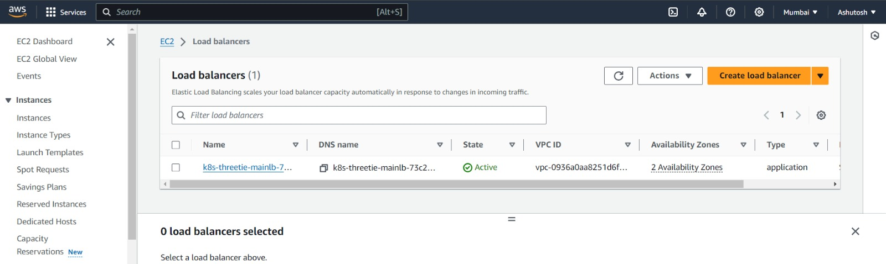
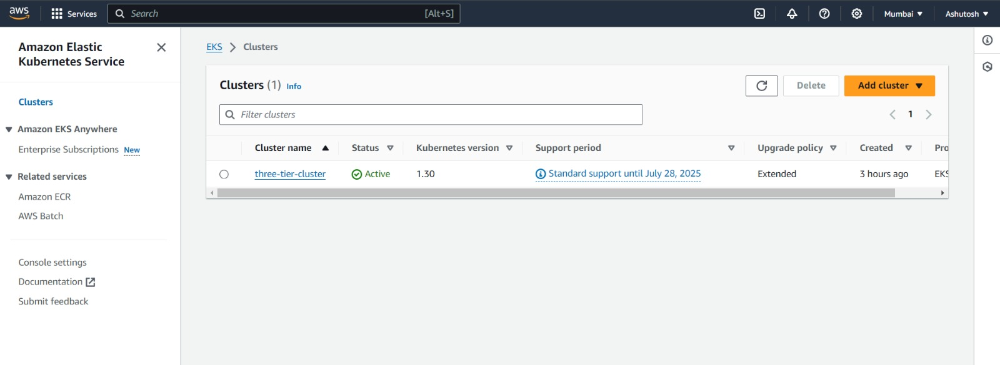
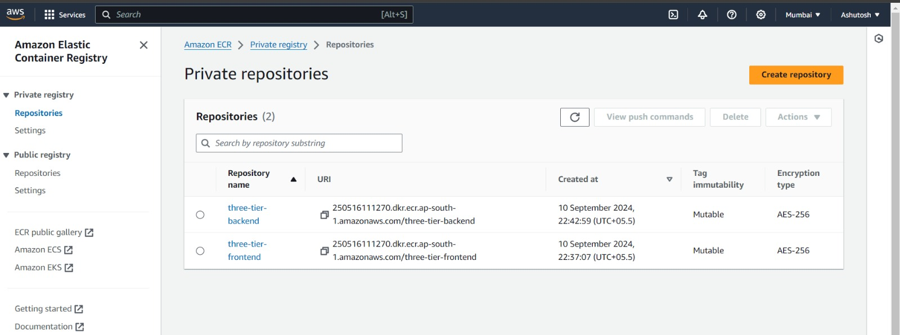
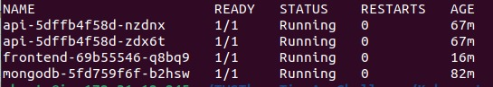

HLD:



ALB:



Cluster:



ECR:



Pods:



# Web Application Deployment on AWS Kubernetes Service

This README explains the step-by-step process for deploying an existing three-tier web application (frontend, backend, and database) on AWS using Kubernetes (EKS).

## Step 1: Launch EC2 Instance for Development

(1) Launch an EC2 instance in your desired region(used ap-south-1 here).

(2) SSH into the instance to set up the development environment.

---

## Step 2: Install Docker

Install Docker on the EC2 instance to containerize the application:

```bash
sudo apt-get update
sudo apt install docker.io
```

Verify the Docker installation:

```bash
docker --version
```

---

## Step 3: Clone the Application Code

Clone the application repository using Git:

git clone https://github.com/Ashutosh-Ahirwar/Brainwave_Matrix_Intern.git

Navigate to the project directory and ensure that the frontend and backend directories exist.

---

## Step 4: Frontend Deployment

### Dockerfile for Frontend

Create a Dockerfile inside the frontend directory:

```docker
FROM node:14
WORKDIR /usr/src/app
COPY package*.json ./
RUN npm install
COPY . .
CMD [ "npm", "start" ]
```

### Build Frontend Docker Image

Build the Docker image for the frontend:

```bash
docker build -t three-tier-frontend:latest .
```

### Test Frontend Container

Run the container to verify it works:

```bash
docker run -d -p 3000:3000 three-tier-frontend:latest
```

If successful, you should be able to access the frontend on port 3000.

### Push Frontend Image to ECR

Push the built image to AWS Elastic Container Registry (ECR):

(1) Authenticate Docker to your AWS account:

    aws ecr get-login-password --region <region> | docker login --username AWS --password-stdin <aws-account-id>.dkr.ecr.<region>.amazonaws.com

(2) Tag the imgae:

    docker tag three-tier-frontend:latest <aws-account-id>.dkr.ecr.<region>.amazonaws.com/three-tier-frontend:latest

(3) Push the image:

    docker push <aws-account-id>.dkr.ecr.<region>.amazonaws.com/three-tier-frontend:latest

---

## Step 5: Backend Deployment

### Dockerfile for Backend

Create a Dockerfile inside the backend directory:

```docker
FROM node:14
WORKDIR /usr/src/app
COPY package*.json ./
RUN npm install
COPY . .
CMD ["node", "index.js"]
```

### Build Backend Docker Image

Build the Docker image for the backend:

```bash
docker build -t three-tier-backend:latest .
```

### Test Backend Container

Run the container to verify it works:

```bash
docker run -d -p 3500:3500 three-tier-backend:latest
```

Verify the backend on port 3500.

### Push Backend Image to ECR

Follow the same steps as the frontend to push the backend image to ECR.

---

## Step 6: Set Up EKS Cluster

Create an EKS cluster using eksctl:

```bash
eksctl create cluster --name three-tier-cluster --region ap-south-1 --node-type t2.medium --nodes-min 2 --nodes-max 2
```

After the cluster is created, set up the kubeconfig:

```bash
aws eks update-kubeconfig --region ap-south-1 --name three-tier-cluster
```

Create a namespace for your deployments:

```bash
kubectl create namespace three-tier
```

---

## Step 7: MongoDB Deployment

### Apply MongoDB Secrets and Deployment

Create and apply the Kubernetes manifest files (secrets.yaml, deployment.yaml, service.yaml) for MongoDB:

```bash
kubectl apply -f secrets.yaml -n three-tier
kubectl apply -f deployment.yaml -n three-tier
kubectl apply -f service.yaml -n three-tier
```

Verify MongoDB pods and services:

```bash
kubectl get pods -n three-tier
kubectl get svc -n three-tier
```

---

## Step 8: Backend and Frontend Deployment

### Apply Backend Deployment and Service

Create and apply the Kubernetes manifest files for the backend (deployment.yaml, service.yaml):

```bash
kubectl apply -f deployment.yaml -n three-tier
kubectl apply -f service.yaml -n three-tier
```

Check logs to ensure the backend is connected to MongoDB:

```bash
kubectl logs <backend-pod-name> -n three-tier
```

### Apply Frontend Deployment and Service

Similarly, apply the manifest files for the frontend:

```bash
kubectl apply -f deployment.yaml -n three-tier
kubectl apply -f service.yaml -n three-tier
```

Verify the pods and services:

```bash
kubectl get pods -n three-tier
```

---

## Step 9: Install AWS Load Balancer Controller

### Install IAM Policy for Load Balancer Controller

Download the IAM policy for the AWS Load Balancer Controller:

```bash
curl -O https://raw.githubusercontent.com/kubernetes-sigs/aws-load-balancer-controller/v2.5.4/docs/install/iam_policy.json
```

Create the IAM policy:

```bash
aws iam create-policy --policy-name AWSLoadBalancerControllerIAMPolicy --policy-document file://iam_policy.json
```

### Attach IAM Policy to EKS

Associate IAM OIDC provider with EKS:

```bash
eksctl utils associate-iam-oidc-provider --region=ap-south-1 --cluster=three-tier-cluster --approve
```

Create a service account with the required permissions:

```bash
eksctl create iamserviceaccount --cluster=three-tier-cluster --namespace=kube-system --name=aws-load-balancer-controller --role-name AmazonEKSLoadBalancerControllerRole --attach-policy-arn=arn:aws:iam::<account-id>:policy/AWSLoadBalancerControllerIAMPolicy --approve --region=ap-south-1
```

### Deploy Load Balancer Controller

Install Helm:

```bash
sudo snap install helm --classic
```

Add the EKS repository to Helm and install the AWS Load Balancer Controller:

```bash
helm repo add eks https://aws.github.io/eks-charts
helm repo update
helm install aws-load-balancer-controller eks/aws-load-balancer-controller -n kube-system --set clusterName=three-tier-cluster --set serviceAccount.create=false --set serviceAccount.name=aws-load-balancer-controller
```

Verify deployment:

```bash
kubectl get deployment -n kube-system aws-load-balancer-controller
```

---

## Step 10: Set Up Ingress for Routing Traffic

Create and apply the ingress manifest file (ingress.yaml):

```bash
kubectl apply -f ingress.yaml -n three-tier
```

Check the ingress:

```bash
kubectl get ing -n three-tier
```

---

## Step 11: Domain Configuration

Finally, configure your domain name to point to the AWS Load Balancer. You can use Route 53 or any DNS service to route traffic to your web application.
